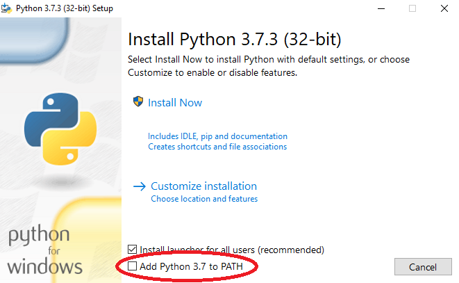

**Chapter one**
=============
**This chapter covers:**
 * [Getting started](#Getting-started)
 * [What is Python](#What-is-Python)
 * [The Python shell](#The-Python-shell)
 * [Expressions](#Expressions)
 * [Assignment and Variables](#Assignment-and-Variables)
 * [Conditionals](#Conditionals)
 * [Functions](#Functions)

## Getting started
### Installation
  Let's start your introduction to Python by making sure you have installed it correctly.    
#### Windows store
  If you're running Windows 10 you can install [Python via the windows store](https://www.microsoft.com/store/productId/9NJ46SX7X90P), which will automatically update your Python to the most current version. You don't have to do this, it's not what I've done personally, but it's worth checking out.   

#### Installer from python.org
Make sure you have the latest version of the installer: 
 * [Windows](https://www.python.org/downloads/windows/)
 * [Mac OS X](https://www.python.org/downloads/mac-osx/)
 * [Linux](https://www.python.org/downloads/source/)  
    
  I'm personally running version 3.7.3, but any version after 3.6 as far as I'm aware will work for what I'll be doing, but to be on the safe side, try to make sure you're on the latest version.  
    
  When you go to install it make sure you check the box that adds Python to PATH. It's on one of the first slides at the bottom of the installer and is usually unchecked by default.     
  This is important as it means you can run Python scripts, access the Python shell, and most importantly for later it'll mean you can use pip from the command prompt.  

### Other software to check out
#### Editors    
  Now that you have Python installed and in your systems PATH environment variable (The windows store version does this, don't worry). We can begin. Feel free to use whatever editor you prefer, it doesn't really matter. 
    If don't know which one to use for Python, here is a list of popular editors:
 * [Pycharm](https://www.jetbrains.com/pycharm/)
 * [Visual Studio Code](https://code.visualstudio.com/)
 * [Notepad++](https://notepad-plus-plus.org/)
 * [Wing IDLE](https://wingware.com/)
 * [Sublime Text](https://www.sublimetext.com/)  
    
  There's more than this out there, but these are all good. And at this point it doesn't really matter, the default editor will work fine.  
#### Formatters
If you have other people working on your code with you, or if you end up taking an extended break from your code, having it be readable and easier to understand is a godsend.  
  You can check some formatters out here:  
   * <https://github.com/Python/black>  
   * <https://www.pylint.org/>  
    
  Programming is about expressing your creative thought into logic that can be understood by a computer, it's why I personally find it so fun. So don't worry if you're not using any of this. Try to remember that, it's supposed to be fun.  


## What is Python
  Python may be different to languages that you have used before or will use in the future. Python is an interpreted high level language. What that means is, Python will talk to your computer and convert the code you've written into instructions that it can understand one line at a time.  
      
  That's what an interpreter does, a compiler on the other hand will convert the entire program to instructions that the computer can understand in one go. They both have their advantages, but generally compilers are faster than interpreters, but I wouldn't worry about that, Python is relevant and widely appreciated by programmers worldwide despite that.  
      
  Continuing the explaination, to be high level as a programming language, the language is far less complex and thus easier for humans to understand, sacrificing performance and control in return for an easier programming experience.  
      
  Because the logic behind programs is generally the same despite this, you still have to think the same way when programming in a lower level language like rust or c++ as you do when you program in Python, but an advantage of it is you can implement your creative ideas quickly and easily.  
    
  Here's a good video that explains the concept well, better than I ever could, even if it is a little dated: <https://www.youtube.com/watch?v=_C5AHaS1mOA>

## The Python shell
  One of the advantages of Python being an interpreted language is that you can write code and get instant feedback. A way to do this is by using the Python shell, to open it you can open the default Python IDLE, or type "py" into cmd or powershell. (If this doesn't work try "Python" or "Python3", if you can't get it to work at all, make sure Python is in your PATH)  
    
  A good way to get an understanding of how the interpreter works is to use the shell, think of every line in your code as another line typed out into the shell. One by one.  
  
  For the first few topics, I will be using the Python in "interactive mode", which is just a fancy way to say that I'll be using the Python shell to demonstrate them.   

## Expressions
### Introduction
  The first concept I would like to introduce to you is **Expressions**. You should be familar with these if you've done any form of mathematics in your life, you might not be familar with the terminology surrounding them and that's okay. That's not what is important here, the skills are.  
    
  Here is an example of an Expression.  
  `(52 + 7  * 4) - 11`  
  You probably know exactly what an expression is now, just by looking at that, but indulge me for a moment, expressions are built up of **operands** and **operators**. Operands in this example being 52, 7, 4 and 11. 
The operators in this case are +, * and -. What it equals isn't really important, but if you figure it out, good for you.  
### Concepts
  Operands can be anything that can represent a value, so if you have `x` that equals a number then that would be a valid operand.  
Operators are the symbols that denote what operation should be done to it's accompanying operands. There are few of them, the ones I want to show you are:  
 * `+` for addition
 * `-` for subtraction
 * `*` for multiplication
 * `/` for division
 * `//` for integer division (AKA floor division/rounding down to the closest lowest whole number)
 * `**` for exponentiation
 * `%` for modular arithmetic (AKA modulus/modulo/mod)  
    
  You might have noticed that the first 4 are pretty simple, and they are.  
### Examples
  Here are some examples of these operations in use, feel free to play around with the Python shell by writing some expressions yourself!
  ```python
  >>> 3 + 2
  5
  >>> 3 - 2
  1
  >>> 3 * 2
  6
  >>> 3 / 2
  1.5
  >>> 3 // 2
  1
  >>> 3 // 2 + 1 # Please note that to do ceiling division, you just add one onto the result of floor division
  2
  >>> 3 ** 2
  9
  >>> 3 % 2
  1
  ```
  ### See also    
  If you need any help understanding integer division, exponentiation or modular arithmetic, then I would recommend checking out these links:  
   * [Floor and Ceiling division](https://www.youtube.com/watch?v=RxNs4SwP6lk)  
   * [Exponentiation](https://www.khanacademy.org/math/pre-algebra/pre-algebra-exponents-radicals#pre-algebra-exponents)  
   * [Modular arithmetic](https://www.khanacademy.org/computing/computer-science/cryptography#modarithmetic)  

## Assignment and Variables
### Introduction
Now this is all well and good, but what if you want to use the result of your expression for later?  
You can assign it to a variable like so: `x = 3 + 2`, this will create an `int` called `x` that is equal to `5`.
You could then use `x` later on, or change it like so:
```python
>>>x = 3 + 2
>>>x
5
>>>x = x - 2 # 5 - 2
>>>x
3
>>>x *= 2 # 3 * 2
>>>x
6
```  
As you may have noticed, I did 
```python
x *= 2
```
this is shorthand for 
```python
x = x * 2
```
it does the same thing and you can use this for **any** operator.  
### Naming

  You can use any letter or an underscore as the first character of a variable name, and for any character after that can be any letter, number or an underscore.  
    
  Now before you go and start naming variables willy-nilly. There are commonly accepted conventions for how you should name things, as I introduce new concepts I'll say what their naming convention is, but as for what we have covered so far by [PEP 8](https://www.Python.org/dev/peps/pep-0008/):
   * Variable names should be completely lowercase with words separated by an underscore
   * Globals (Variables that can be accessed from anywhere in the code and can be changed) should follow the same convention as variables
   * Constants (Variables that you can access for later, and which shouldn't be changed e.g. `PI = 3.14`) should be completely uppercase with words seperated by an underscore  
      
  I wouldn't worry too much about globals or constants, as you probably won't be needing to use them for a while.  
       
  **If you use a lint one of the things that it will check is if you follow naming conventions.**
   
## Conditionals
### Introduction
What if we wanted to do different things to `x` based on what `x` is?  
  Well, we can, we can use an `if` statement. Usage in Python looks like this:
```python
if condition:
  do stuff
```
`condition` in this case is a conditional, some examples being:
```python
>>>x = 0
>>>x
0
>>>x == 0 # x is equal to 0
True
>>>x > 0 # x is greater than 0
False
>>>x <= 0: # x is less than or equal to 0
True
>>>x != 0: # x is not equal to 0
False
```
### Booleans and equivalences
As you can see, these conditionals return `True` or `False`, this is because they are booleans. Equivalents to these will also work as conditions. If `x` is `1` then `x` will be equivalent to `True` meaning instead of having to write:
```python
if x == 1:
```
you can write
```python
if x: # this is shorthand for if x is True
```
The opposite goes for `False`
```python
if x == 0:
```
to get this, we have to **negate** (invert) the previous statement, we do this by using `not`
```python
if not x:
```
### Using the `and` and `or` keywords
If you want to have multiple conditions where they both have to be `True` you can do this
```python
if condition1 and condition2:
  do stuff
```
if you want to have multiple conditions where only one has to be `True` you can do this
```python
if condition1 or condition2:
  do stuff
```
it's very important that you make sure that your conditional is written correctly, sometimes you will need to use parenthesis
```python
>>> False and True or True # False and True have to be the same so they're False, making the statement False or True, so this is True
True
>>> False and (True or True) # False and (True or True) becomes False and True, which is False
False
>>> (False and True) or True # False and True make False, making the statement False or True, so this is true
True
>>> not False and True or True # not False, which is True makes the statement True and True or True, which is going to be True
True
>>> not (False and True or True) # this is a negation of the first conditional, so it is False
False
```
don't forget, even these statements using `or` and `and` are conditionals too.  
### `if` statements
  You can use these conditionals inside `if` statements (and loops, which I'll explain in the future!) but it's time to explain how `if` statements work in Python, there are:
 * `if` statements, these are the first part of your if statement
 * `elif` statements, these are the same as `if` statements, but they are checked after the statement above them if it isn't `True`
 * `else` statements, these do not have any conditions, but you can use them to catch if your `if`s and `elif`s turn up `False`  
       
  Let's see some examples of them:
```python
if False: # Because this conditional is False, the code inside it will not run, instead it will check the next part of the if statement, the elif statement
  do stuff 
elif False: # This conditional is also False, so the program will move onto the next statement
  do stuff:
elif True: # Because this conditional is True, the code inside it will be run
  do stuff
else: # Because the statement before it was True, the code inside the else statement will not be run because the if statement ended at the second elif
  do stuff
```
    
  **From this point on I will be using "Script mode", meaning I'll have a Python file open and running that instead of typing line by line into the shell. Unless I'm not and I say so.**  

## Functions

### Defining and returning
    
  Ok so we're nearly there, the end of chapter one, but this is one of the most important parts of this chapter: Functions.  
  What are functions? What if you could do the same piece of code to different variables, **without** having to write the code multiple times? That's what a function is, it allows you to set special variables only it can use inside itself, where you can give it instructions on what you want it to do with it, you can have it `return` values back or just do an action.  
    
  **Functions follow the same naming convention as variables (lowercase with words seperated by underscores)**  
    
  To define a function, we use the `def` keyword followed by what we want to name the function, ending the line with parenthesis with what variables we want to use inside inside them. With a colon as the last character.  
    
  Let's look at an example:
```python
def function(x, y):
  z = x + y
  z =* y
  return z
```
This will return the product of `y(x + y)`, if `x` was `2` and `y` was `3` then `function(3, 2)` would return `z` which would be equal to `10`.  
  You might be wondering why I don't write this instead:
```python
def function(x, y):
  x += y
  x *= y
  return x
```
it will do the same thing, however, this is bad practice, as in the future some different types of variables can be edited from inside a function this way.  
  You can however compact this code down to one line, and you should try to make sure your code takes up as least amount of lines as possible, just be sure to keep it readable, [PEP 8](https://www.Python.org/dev/peps/pep-0008/#maximum-line-length) recommends a maximum line length of 79 characters (72 for comments and docstrings, which I'll bring up soon), this is what lints and formatters will try to enforce, it's good habit to keep your code succint. like so:
```python
def function(x, y):
  return (x + y) * y
```
It ends up looking a little more complicated, but I'd recommend trying to do this where you can, just make sure you don't go overboard and create problems for yourself or others later down the line by making it hard to understand. Try to find a good balance.  
### Calling a function
  Returning is all well and good, but it's useless if we're not returning into something. So when we call the function, instead of just writing `function(2, 3)` we can write `z = function(2, 3)`, this way we can use the value that is returned later, as a variable.  
    
  You can also call functions from inside themselves and other functions. Examples being:
  ```python
  def function1():
    function1() # This will go on forever, in theory. This is called recursion and it is a very powerful tool

  def function2():
    function1()

  def function3():
    def function4():
      pass
  
  def function5():
    function4() # You cannot do this, as function4 was defined inside function 3 and can only be used inside it
```  
    
  Functions don't have to return something, they can just print something instead of returning it, or they can save something to a file, it's up to you. Remember: Python can do anything.  
    
### Docstrings and formatting
#### Introduction
Since I've brought up [PEP](https://www.Python.org/dev/peps) a couple times, I should probably talk about it in a little more depth, it's the official standard for how you should do things in Python, you code will work regardless of whether you follow it, but if you ever want to work collaboratory with other Python programmers, these rules are built upon the most common practices of the programmers out there, however if you want to use tabs over spaces, not include docstrings or go over the recommended line character limit, that's totally within your rights.  
  But someone, somewhere will judge you for it, especially if you use different indentation to them.  
  People really hate that.  
#### Indentation
Python unlike other languages enforces indentation, either a tab, 4 spaces or 2 spaces, although the first two are probably the better option in my opinion.  
  Indentation is the whitespace that aligns your code so you can see what scope (what your code is inside of) is in. Generally good practice in other languages, but compulsory and part of the syntax in Python.  
  Most editors auto indentate for you, so it's not too difficult. However whichever indentation method you choose, you must stick to it. **Do not mix tabs and spaces**. Keep your indentation consistent.

#### Commenting
As you have probably noticed, I have been putting comments into some of the coding examples behind a `#`. This is how you comment in Python, the space that I put after the `#` is optional, but is recommended by [PEP 8](https://www.python.org/dev/peps/pep-0008/#comments). Comments are handy when you want to explain what a complex line does, or for what you need to implement later. Use them in whatever way you see fit, they don't affect how the code is run. 

#### Single line Docstrings    
  Docstrings are covered by [PEP 257](https://www.Python.org/dev/peps/pep-0257/#one-line-docstrings), but to summarise it:
   * Describe what your function is supposed to do, on the line after your function definition, in the form of "Do X and return Y"
   * Use triple quotes (""")  
    
  This is just for one line docstrings, which for this level will be more than enough.  
    
  A function with a docstring using our previous example would look like:
```python
def function(x, y):
  """Multiply the product of x + y by y and return the result"""
  return (x + y) * y
```
Note that I put a space after commas and around operators, this is covered by [PEP 8](https://www.Python.org/dev/peps/pep-0008/#whitespace-in-expressions-and-statements), you don't have to do it, but I think it just looks nice.

## Congratulations!
You did it!  
     
  You made it to the end of chapter one, which covers some basics of Python, probably around 1-2 weeks worth of university level content that they teached me here in Canterbury, but I skimmed a fair bit of stuff. Don't feel disparaged if you don't get it all after reading it though, you'll get it as you go along and this tutorial isn't going anywhere, so you can always have it or any other resource open alongside your editor as you go.  Use what you have as you study, and to the lovely dude who I wrote this for, you especiallly, **don't feel afraid to ask me questions** :).
